## System Diagram

```mermaid
graph TD
    User["🧑 User (Browser)"]
    CF["☁️ CloudFront\nCDN + HTTPS"]
    S3F["🪣 S3\nNext.js Frontend"]
    APIGW["🔌 API Gateway\nHTTP API"]
    Lambda["⚡ Lambda\nFastAPI + Mangum"]
    Bedrock["🤖 Amazon Bedrock\nNova Micro"]
    S3M["🗂️ S3\nConversation Memory"]

    User -->|HTTPS| CF
    CF -->|Static assets| S3F
    CF -->|POST /chat| APIGW
    APIGW -->|Invoke| Lambda
    Lambda -->|Converse API| Bedrock
    Lambda -->|Read / Write session| S3M
    Bedrock -->|AI response| Lambda
    Lambda -->|JSON response| APIGW
    APIGW -->|Response| CF
    CF -->|Rendered reply| User
```

## Components

- **User (Web Browser):** Interacts with the chat UI served by the Next.js frontend.
- **CloudFront:** CDN layer — serves the static frontend globally over HTTPS and routes API traffic.
- **S3 (Frontend):** Hosts the Next.js static export, served via CloudFront.
- **API Gateway (HTTP API):** Receives chat requests from the frontend and proxies them to Lambda.
- **Lambda (Python 3.12):** Runs the FastAPI application via the Mangum adapter — handles chat logic, session memory, and Bedrock calls.
- **Amazon Bedrock (Nova Micro):** Provides AI-generated responses using the Bedrock Converse API.
- **S3 (Memory):** Persists conversation history per session as JSON objects. Falls back to local file storage in development.
- **me.txt:** System prompt file that defines the AI's personality and knowledge about Okey Obia.

## Data Flow

1. User sends a message via the Next.js frontend.
2. Frontend POSTs the message and session ID to API Gateway (`/chat`).
3. API Gateway invokes the Lambda function.
4. Lambda loads the session's conversation history from S3.
5. Lambda builds the prompt (system context from `me.txt` + conversation history + new message) and calls Amazon Bedrock via the Converse API.
6. Bedrock returns a response; Lambda appends both the user message and assistant response to the session history and saves it back to S3.
7. Lambda returns the response to API Gateway, which sends it back to the frontend.
8. Frontend displays the assistant's response.

## Infrastructure

All infrastructure is provisioned with Terraform, organized into six modules:

| Module        | Resources                                                     |
| ------------- | ------------------------------------------------------------- |
| `s3`          | Frontend hosting bucket + memory storage bucket               |
| `acm`         | ACM certificate + Route53 DNS validation (us-east-1)          |
| `cloudfront`  | CloudFront distribution (CDN + HTTPS)                         |
| `lambda`      | IAM role + Lambda function                                    |
| `api_gateway` | HTTP API, routes (`/`, `/chat`, `/health`), Lambda permission |
| `dns`         | Route53 alias A/AAAA records (optional custom domain)         |

## Deployment

CI/CD runs on GitHub Actions. On every push to `main`:

1. Lambda is packaged with `uv` and uploaded.
2. Terraform provisions or updates all infrastructure.
3. Next.js is built as a static export and synced to S3.
4. CloudFront cache is invalidated.

Authentication between GitHub Actions and AWS uses OIDC — no long-lived credentials are stored.
